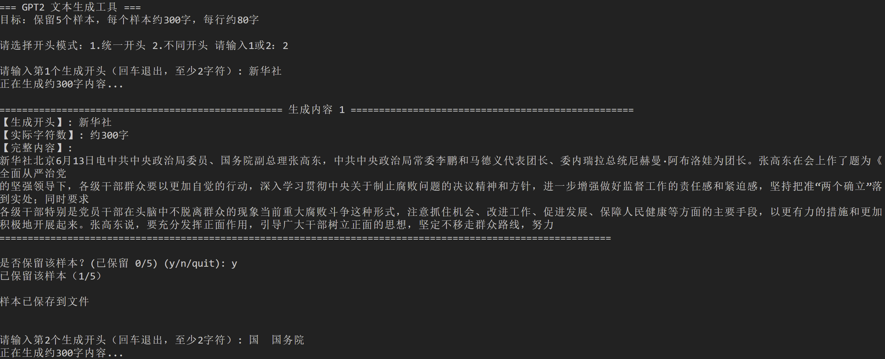

# GPT-2 Project

This is the repository for the Entrance Exam of the AI Design Course 2H 2025.

## Student Info
- [Zhang Wenxuan/张文轩](25213040254@m.fudan.edu.cn), Student ID: 25213040254

## Requirements

- Train a language model based on Chatgpt2/nanogpt
- Prepare your own dataset
- Train this model using the dataset through the GPU
- Use the trained model for inference, enabling it to generate more than ten consecutive sentences.

## Project Description

### 1. Project Structure

- `config/`: contains model configuration file which defines the architecture of the GPT-2.
- `data/`: contains the Chinese datasets used for training the language model.
- `generated/`: stores generated text outputs produced by the trained GPT-2 model.
- `model/`: stores the trained GPT-2 model checkpoints, weights, and related training artifacts
- `tensorboard_summary/`: stores TensorBoard logs, including training loss, perplexity, and other metrics, which can be visualized with TensorBoard to monitor training progress.
- `tokenizations/`: contains tokenization scripts and vocab files used for text preprocessing.
- `requirements.txt`: lists all Python dependencies required to run the project.
- `train.py`: the training python script for fine-tuning GPT-2 on Chinese datasets.
- `generate.py`: the text generation script for inference using the trained GPT-2 model.


### 2. Model Configuration

In this project,  I choose to use GPT-2 as the basic model architecture. GPT-2 is a transformer-based autoregressive language model. It is a simple, efficient, and effective version of GPT. 

The specific configuration is defined in `config/model_config.json`, which includes the following hyperparameters. 

- `initializer_range`: 0.02：defines the standard deviation for model parameter initialization. The weights are randomly drawn from a normal distribution with mean 0 and standard deviation 0.02, whose small variance helps ensure stable convergence during training.

-  `layer_norm_epsilon`: 1e-05：a constant added to the denominator in layer normalization to avoid division by zero. Setting value 1e-5 improves numerical stability and prevents training instabilities caused by very small variances.

- `n_ctx`: 1024：specifies the context window size, i.e., the maximum sequence length the model can consider when generating or processing text. With this value, the model can handle up to 1024 tokens at once, allowing it to capture long-range dependencies in text.

-  `n_embd`: 768：the dimensionality of token embeddings and hidden states, which determines the expressive capacity of the model. This value indicates that each token in the vocabulary is represented as a 768-dimensional vector.

-  `n_head`: 12：the number of attention heads in the multi-head self-attention mechanism. The 768-dimensional embedding is split evenly across 12 heads, with 64 dimensions per head.

- `n_layer`: 12：the number of stacked Transformer blocks in the model. With 12 layers, the model has significant representational depth, allowing it to capture complex hierarchical features in language.

- `n_positions`: 1024：the number of unique positional embeddings available, which matches n_ctx and ensures that each position up to 1024 tokens has its own positional encoding, enabling the model to differentiate between tokens at different positions in a sequence.

-  `vocab_size`: 21128：the size of the tokenizer’s vocabulary, i.e., the number of unique tokens the model can process. A vocabulary size of 21,128 indicates that the model is adapted for Chinese language data, where a large vocabulary is required to represent diverse characters, subwords, and punctuation.

### 3. Dataset

The training data is derived from the OpenNewsArchive dataset, a large-scale collection of news texts hosted on OpenDataLab. The original dataset is stored in the `news_original.jsonl` file, which contains structured news entries (e.g., title, content, publication date).

For access to the original dataset and more details, refer to:
[OpenNewsArchive on OpenDataLab](https://opendatalab.com/OpenDataLab/OpenNewsArchive)

Data preprocessing is performed to adapt the raw dataset for GPT-2 training, and the detailed workflow is outlined below.

- First, `extract_txt.py` script is used to select the top 20,000 news entries, generating `top20k_content.txt` file.

- Next, `convert_txt_to_json.py` script is applied to clean the raw text, which includes removing control characters, trimming whitespace, and converts the entries into the JSON format needed by GPT-2 training.

- Finally, `train_20k.json` file is generated as a structured JSON file ready for GPT-2 training, containing entries following a consistent format as follows:
```json
{
  "text": "新闻的具体内容"
}
```

- The dataset used in this project is about 58.1MB in size, with 21,213,590 characters, and 6268 of them are unique.

### 4. Model Training

The model is trained by using the `train.py` script, which supports distributed training across multiple GPUs, gradient accumulation, mixed-precision optimization (fp16), and dynamic learning rate scheduling with warmup steps. 

To train the model, the following command can be used:

```bash
python train.py \
  --model_config config/model_config.json \
  --tokenized_data_path data/tokenized/ \
  --tokenizer_path cache/vocab_small.txt \
  --raw_data_path data/train_20k.json \
  --epochs 15 \
  --log_step 200 \
  --stride 512 \
  --output_dir model/ \
  --device 0,1 \
  --num_pieces 100 \
  --raw
```

This command specifies a 15-epoch training run on two GPUs, with tokenized data divided into 100 shards, a stride of 512 for sequence sampling, and regular logging every 200 steps. 

During training, the raw dataset is first tokenized and split into multiple pieces to enable efficient loading. Each sample sequence is truncated or padded to match the model context window `n_ctx`, and loss is computed directly via the GPT-2 language modeling head. Intermediate losses during the training process are logged using TensorBoard. 

The trained checkpoints are saved under the `model/` directory, while the final optimized model is saved in the `model/final_model/` path for inference tasks.

In practical operation, the training process was conducted using two NVIDIA L40 GPUs, and the entire training process took 6 hours to complete, with the loss around 0.30 towards the end.
 
### 5. Text Generation

Text generation is performed using the `generate.py` script, which provides an interactive interface to sample sequences from the trained GPT-2 model. The script implements two decoding strategies: a standard step-by-step sampling procedure and a fast generation mode that caches past states to reduce computation overhead. To improve generation quality and control randomness, the script supports temperature scaling, top-k sampling, nucleus sampling, and repetition penalties to discourage redundant loops.

The script further includes functionality for **both unified prefix mode and independent prefix mode**. Moreover, it provides an interactive sample filtering workflow: each generated passage is displayed to the user, who can decide whether to accept or reject it. Accepted samples are optionally saved to disk with metadata under the `generated/` directory. The script terminates once the specified maximum number of accepted samples is reached, providing both flexible control during generation and reproducible outputs for later evaluation.

<center class ='img'>

</center>
<br>
To use the model for text generation, the following command can be used:

```bash
python generate.py \
    --model_path model/final_model \
    --save_samples \
    --length 300 \
    --max_accept 5 \
```

The total word count of the generated text `length` and the number of generated text samples `max_accept` can be flexibly configured in the above command. The final result is saved in the `generated/ generated_content.txt` file. Two Files `sample_1.txt` and `sample_2.txt` , respectively representing generating results of unified prefix mode and independent prefix mode, are uploaded under the `generated/` dictionary in this project. Here are some examples during the testing process:

```markdown
1: **据报道**，该公司在2016年年报中表示，受到市场波动以及疫情影响，今年一季度净利润增幅大约39%，但亏损额较小。“我们预计二季度的业绩快速上升是有史新高”，上半年净利润同比减少5.78亿元至43亿元，同比降低11.48亿元；扣除非经常性损益后归属母公司所有者权益的扣除非经常性损益后归属于母公司所有者权益的净利润，则由盈转正，因此毛利率下滑主要来自于公允价值变动、期限制与境内客户对应的扣除非经常性损益的净利润增长相当于其他行为的净收入增长。此外，报告也指出了这些行为，尤其是针对境外存在的不同情况下，境外存在的境外存在必需消费者以及境外产品的非经常性和无风险等问题，而且境外存在的境外活动并未得到根本

2: **新闻**记者注意到，2013年以来全国多个省份组织开展了“一带一路”沿线国家和地区的交流与合作，为各地探索实施“一带一路”建设工程奠定坚实基础。目前，“一带一路”共建成包括7条铁路沿线国家货运航线、6个大型客车公司等在内的14个重点项目已获得批复，并且通过邮电通信网络平台进行试运营；“一带一路”沿线国家及地区货物从业人员超过2.8万人。深化务实合作推动沿线经贸往来高质量发展**随着互联网技术不断进步，中国对外开放水平越来越有利，同时更加关注经济社会发展。近日，《中华人民共和国促进外商投资协议》签署的《中华人民共和国政府和我国市场长期睦邻友好合作谅解备忘录》宣布施行。该协议旨在引导外商投

3: **中新社**北京9月18日电题：“三八”国际关系与发展议程研究报告高峰论坛在京举行，来自世界各地的30多位代表和政府官员。在这一天的会议上，有27位代表出席了全体会议，其中包括中国人民大学教授白丁宁主持的《第六次全球发展战略》、“中国对外开放先进制度框架协调发展的决定》等；也有26位代表将作为《第七次全球发展战略》重要讲话；另外，还有4位代表分别是联合国人权科学基金理事会常任理事长单位、世界银行业委员会副理事长单位、世界银行业委员会常任理事长单位等；5位代表分别聚焦联合国粮农组织（who）领导人非常关注的问题。联合国粮农组织总干事张子宏宣布了“三八”国际发展议程，并就此建立了紧密双边关键核心技术伙伴关系

4: **习近平**总书记在重庆考察时发表的一篇题为《扩大高水平对外开放、构建新发展格局的若干意见》的文章作出部署。文章强调，要加快形成全面从严治党体系和能力现代化、完整准确定任务。坚持问题导向和目标导向是什么？着眼于解决好“两个毫不动摇”的重点难点问题，聚焦主责主业，切实把人民群众满意的服务送到实处。推进科技自立自强“三个更加突出”专项行动方案提升质量效率10月26日下午，习近平总书记来到湖北宜昌市巴山区，考察了宜昌市巴山区的一座历史文化遗址。这里有很多小学生，每周都要去看望慰问，他们会先后讲解员洁身教育、听课过程中遇到的困难和思想障碍，并以此为契机，倾听老师讲述他们的故事。这就是在长江经济带污染防治攻关

5: **新华社**北京6月13日电中共中央政治局委员、国务院副总理张高东，中共中央政治局常委李鹏和马德义代表团长、委内瑞拉总统尼赫曼·阿布洛娃为团长。张高东在会上作了题为全面从严治党的坚强领导下，各级于部群众要以更加自觉的行动，深入学习贯彻中央关于制止腐败问题的决议精神和方针，进一步增强做好监餐工作的青任感和紧迫感，坚持把准"两个确立"或到实处;同时要求各级干部特别是党员干部在头脑中不脱离群众的现象当前重大腐败斗争这种形式、注意抓住机会、改进工作、促进发展、保人民健康等方面的主要毛段，以更有力的措旅和更加积极地开展起来。张高东说，要充分发挥正面作用，引导广大干部树立正面的思想，坚定不移走群众路线，努力
